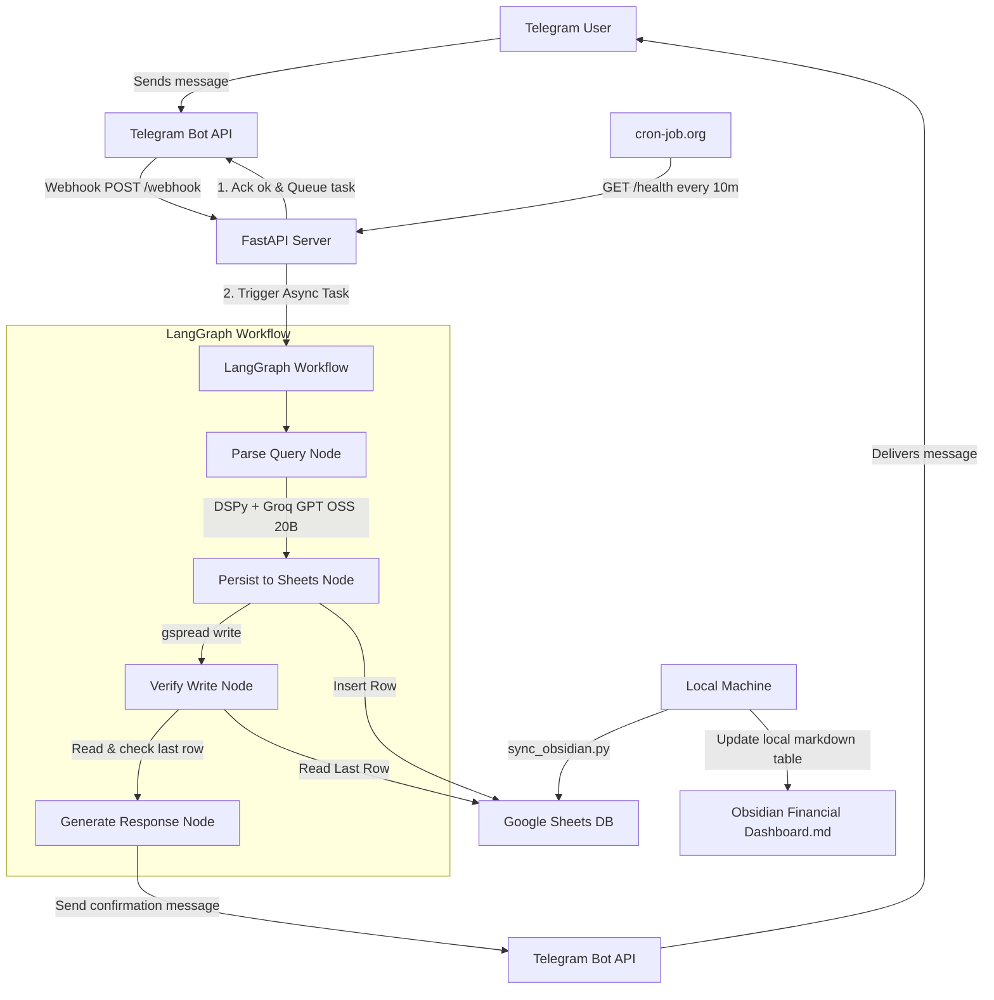

# Daily Expenses Bot Implementation Plan

This plan details the design and implementation of a daily expenses tracker bot. The workflow processes expense messages sent via Telegram, uses a LangGraph workflow and DSPy with Groq to structure the expense detail, appends the record to a Google Sheet database, verifies the write operation, sends a confirmation back to the user, and provides a utility to sync this data with a local Obsidian Markdown dashboard.

---

## Architecture Overview



---

## User Review Required

> [!IMPORTANT]
> **Obsidian Sync Strategy:** 
> Because the server runs on Vercel (in the cloud) and your Obsidian vault is local (`D:\Obsidian Vault\Financial Dashboard.md`), the cloud server cannot directly write to your D: drive.
> 
> We propose two ways to sync data to Obsidian:
> 1. **Option A (Recommended):** We provide a local Python script (`sync_obsidian.py`) that you can run on your local machine (manually or as a local Windows Task Scheduler job) which pulls the latest entries from the Google Sheet and appends/syncs them directly into your local `Financial Dashboard.md` note in a clean Markdown table format.
> 2. **Option B:** You configure an Obsidian Community Plugin (like *Google Sheets* or *Dataview* via a custom script) to retrieve Google Sheets data when Obsidian is open.
> 
> *Please confirm if Option A meets your expectations or if you prefer another approach.*

> [!WARNING]
> **Telegram Webhook Setup:**
> When the FastAPI server is deployed to Vercel, we will need to register its public URL with the Telegram Bot API using the `setWebhook` endpoint. We will provide a helper script/endpoint to automatically handle this.

---

## Proposed Changes

We will create the project inside `d:\MO\Ai_Projects\Daily_Expenses_Bot`.

### Dependencies

#### [NEW] [requirements.txt](file:///d:/MO/Ai_Projects/Daily_Expenses_Bot/requirements.txt)
Defines the required library versions for FastAPI, LangGraph, DSPy, gspread, and httpx:
```text
fastapi>=0.110.0
uvicorn>=0.28.0
python-dotenv>=1.0.1
gspread>=6.0.0
google-auth>=2.28.0
langgraph>=0.0.30
dspy>=2.5.0
httpx>=0.27.0
pydantic>=2.6.0
```

### Configuration & Entrypoint

#### [NEW] [config.py](file:///d:/MO/Ai_Projects/Daily_Expenses_Bot/config.py)
Handles environment variable loading, validation, and loading of Google credentials from JSON.

#### [NEW] [main.py](file:///d:/MO/Ai_Projects/Daily_Expenses_Bot/main.py)
The entry point of the FastAPI application.
- Houses the webhook endpoint `/webhook` which validates requests, schedules the background worker using FastAPI's `BackgroundTasks`, and immediately returns a `{"status": "ok"}` response.
- Houses the health endpoint `/health` for the `cron-job.org` pinger.

### LangGraph Workflow & DSPy Extractor

#### [NEW] [dspy_extractor.py](file:///d:/MO/Ai_Projects/Daily_Expenses_Bot/dspy_extractor.py)
Defines the DSPy Signature and Program to extract structured JSON from raw messaging text:
- **Input:** Raw chat message (e.g., "50 USD for dinner at McDonald's yesterday").
- **Output Schema (Pydantic):**
  - `date`: ISO string (YYYY-MM-DD) - resolved from relative words like "yesterday", "today", "last Friday".
  - `amount`: float (e.g., 50.0).
  - `currency`: str (e.g., "USD", "EGP", default based on locale/user context).
  - `description`: str (e.g., "Dinner at McDonald's").
  - `category`: str (e.g., "Food", "Transport", "Utilities", "Entertainment", "Other").
  - `payment_method`: str (e.g., "Cash", "Card", "Wallet").

#### [NEW] [sheets_client.py](file:///d:/MO/Ai_Projects/Daily_Expenses_Bot/sheets_client.py)
Helper functions to interact with Google Sheets:
- Connects using `GOOGLE_SERVICE_ACCOUNT_JSON` and `GOOGLE_SHEET_ID`.
- `append_expense(expense: dict)`: Appends a row containing `[Date, Amount, Currency, Description, Category, Payment Method, Created At]`.
- `get_last_expense()`: Returns the last row's data to compare for verification.

#### [NEW] [agent.py](file:///d:/MO/Ai_Projects/Daily_Expenses_Bot/agent.py)
Orchestrates the workflow logic using **LangGraph**:
1. **Node 1: `parse_expense`** -> Calls `dspy_extractor` to structure the text message.
2. **Node 2: `persist`** -> Calls `sheets_client` to append the entry.
3. **Node 3: `verify`** -> Reads the last record from `sheets_client` and validates that the appended values match the expected structure.
4. **Node 4: `respond`** -> Sends an HTTP POST message back to the Telegram User using `httpx` to report success or detail failure.

### Local Integration

#### [NEW] [sync_obsidian.py](file:///d:/MO/Ai_Projects/Daily_Expenses_Bot/sync_obsidian.py)
A local helper script designed to run on your Windows machine:
- Reads the Google Sheet.
- Parses the entries.
- Replaces/Updates the markdown table inside your `D:\Obsidian Vault\Financial Dashboard.md` note so you can view financial insights locally.

---

## Verification Plan

### Automated Tests
- We will construct unit/integration tests to verify individual components:
  - Mock Telegram requests and verify the FastAPI endpoint schedules background tasks correctly.
  - Test DSPy extraction using dummy expense texts and check that it parses fields correctly (currency, amount, date resolution).
  - Test Google Sheets write and verification flow using a sandbox sheet.

### Manual Verification
1. **Local Test:** Run FastAPI server locally using `uvicorn main:app --reload` and use `ngrok` or similar to expose it, or send mock HTTP POST requests to `/webhook` directly.
2. **Mock Webhook Payload:** Send simulated payload:
   ```json
   {
     "message": {
       "chat": {"id": 12345678},
       "text": "120 EGP for transport today",
       "date": 1724773400
     }
   }
   ```
3. Check if Google Sheet gets the record.
4. Verify that the Telegram webhook gets an immediate `200 OK` response and a notification is sent back to the mock user.
