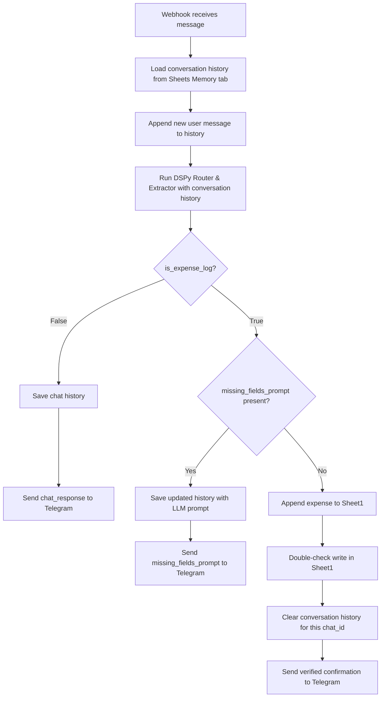

# Daily Expenses Bot Implementation Plan (Updated)

This updated plan details the design for:
1. Connecting your local Obsidian vault (`Financial Dashboard.md`) to your Google Sheets database.
2. A conversational router and slot-filling agent using LangGraph, DSPy, and Groq.
3. Multi-turn memory persistence stored inside the Google Sheet database.

---

## 1. Connecting Obsidian to Google Sheets

Since Obsidian is local and Google Sheets is in the cloud, the most robust way to read Google Sheets data dynamically inside Obsidian (Option B) is to use **Obsidian DataviewJS** combined with Google Sheets' **Publish to Web** feature.

### Setup Steps:
1. In Google Sheets, go to **File** ➔ **Share** ➔ **Publish to the web**.
2. Select **Sheet1** and change the format to **Comma-separated values (.csv)**.
3. Click **Publish** and copy the generated URL (it will look like `https://docs.google.com/spreadsheets/d/e/2PACX-.../pub?output=csv`).
4. In your Obsidian note `D:\Obsidian Vault\Financial Dashboard.md`, insert the following DataviewJS code block to dynamically fetch and display your expenses:

```javascript
```dataviewjs
const csvUrl = "YOUR_PUBLISHED_CSV_URL_HERE";

try {
    const response = await fetch(csvUrl);
    if (!response.ok) throw new Error("Network response was not ok");
    const csvText = await response.text();
    
    // Simple CSV parser
    const rows = csvText.split("\n").map(row => {
        // Handle quotes in CSV values if necessary
        return row.split(/,(?=(?:(?:[^"]*"){2})*[^"]*$)/).map(val => val.replace(/^"|"$/g, '').trim());
    });
    
    const headers = rows[0];
    const data = rows.slice(1).filter(r => r.length > 1 && r[0] !== "");
    
    // Sort transactions by date (descending)
    data.reverse();
    
    dv.header(2, "💰 Latest Transactions");
    dv.table(
        ["Date", "Amount", "Currency", "Description", "Category", "Payment Method"],
        data.slice(0, 10).map(r => [r[0], `${r[1]}`, r[2], r[3], r[4], r[5]])
    );
    
    // Insights calculate
    let totalEGP = 0;
    data.forEach(r => {
        if (r[2] === "EGP") totalEGP += parseFloat(r[1] || 0);
    });
    
    dv.paragraph(`**Total Expenses logged (EGP):** ${totalEGP.toFixed(2)} EGP`);
} catch (error) {
    dv.paragraph("❌ Failed to load financial data: " + error.message);
}
```
```

This script will run automatically inside Obsidian whenever the note is opened and you have an active internet connection.

---

## 2. Conversational Agent & Memory Architecture

We will implement a unified conversational loop. Because Vercel is stateless, we will store chat history for each `chat_id` in a new worksheet named `Memory` inside the same Google Sheet.

### State Memory Table Schema (`Memory` Tab)
| Chat ID | Conversation History (JSON string) | Last Updated |
| :--- | :--- | :--- |
| `123456` | `[{"role": "user", "content": "Kabab"}, {"role": "assistant", ...}]` | `2026-08-27 16:00:00` |

### DSPy Unified Router & Extraction Output Schema
We will create a Pydantic model `RouterOutput` to handle routing, field extraction, and missing field collection in one pass:

```python
class RouterOutput(BaseModel):
    is_expense_log: bool = Field(description="True if the user is trying to log an expense or providing answers to collect missing details. False if they are just chatting.")
    chat_response: Optional[str] = Field(description="Chat response if is_expense_log is False (friendly conversation). Leave empty if logging an expense.")
    
    # Extracted Expense Fields (Optional because they might be collected across turns)
    date: Optional[str] = Field(description="YYYY-MM-DD. Resolve relative dates (today, yesterday) based on current_date.")
    amount: Optional[float] = Field(description="Numeric amount of expense.")
    category: Optional[str] = Field(description="Expense category in Arabic/English (e.g. اكل/Food, مواصلات/Transport, فواتير/Utilities, تسوق/Shopping, ترفيه/Entertainment, صحة/Health, أخرى/Other).")
    description: Optional[str] = Field(description="Description of purchase.")
    currency: Optional[str] = Field(description="Currency. Default is EGP.")
    payment_method: Optional[str] = Field(description="Payment method. Default is Cash.")
    
    # Missing Fields Prompt
    missing_fields_prompt: Optional[str] = Field(description="If is_expense_log is True but any of the mandatory fields (date, amount, category) are missing, generate a friendly, natural message in the user's language (Arabic or English) asking for the missing fields. If all mandatory fields are present, leave this empty.")
```

---

## 3. Workflow Flowchart



---

## Proposed Code Changes

1. **[sheets_client.py](file:///d:/MO/Ai_Projects/Daily_Expenses_Bot/sheets_client.py)**: Add functions to read, update, and clear conversation history in a new `Memory` worksheet.
2. **[dspy_extractor.py](file:///d:/MO/Ai_Projects/Daily_Expenses_Bot/dspy_extractor.py)**: Replace signature and parsing function to accept conversation history list and return the `RouterOutput` model.
3. **[agent.py](file:///d:/MO/Ai_Projects/Daily_Expenses_Bot/agent.py)**: Modify the LangGraph state and nodes to integrate the chat history loading, conditional routing, missing fields feedback, and memory clearing.

---

## Verification Plan

1. **Automated Unit Tests (`test_workflow.py`):**
   - Test 1: Just chatting (e.g. "Hello bot"). Verify it returns `is_expense_log = False` and a chat response.
   - Test 2: Incomplete expense (e.g. "I ate Kabab"). Verify it returns `is_expense_log = True` and prompts for the amount.
   - Test 3: Complete turn (e.g. History: `"I ate Kabab"` + Bot prompt + `"It cost 150"`). Verify it resolves the full details (Amount: 150, Category: اكل, Description: Kabab, Date: today) and has no missing fields prompt.
2. **Manual Test:** Expose server locally, message the bot to test memory retention across requests, check if Google Sheet gets the record, and verify memory is cleared upon completion.
